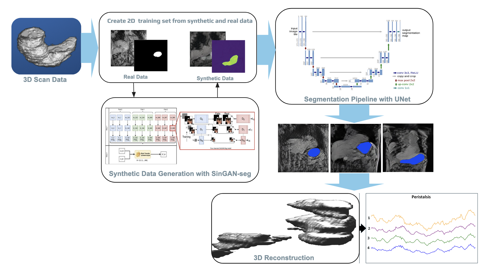

## ***AN AUTOMATED SEGMENTATION PIPELINE FOR QUANTIFYING GASTRIC MOTILITY IN HUMANS USING 4D CINE MAGNETIC RESONANCE IMAGING***

### **Pipeline Documentation**

#### **Preprocessing**

- Use this file to view the temporal image and mask together over time: `/view-temporal-images-and-masks.m`
- Then use this file to check keys and dimensions etc: `/check-file-details.m`
- Break down ALL original 4d file into individual frames or slices with this file `make-cine-mri-pngs.m`
- Turn the .mats into pngs and rename using `convert-mat-to-png.py`
- Resize images: Use `resize-to-256.m` to resize to 256x256 pixels
- If the image is in RGB format, convert it to grayscale
- Remove any images that do not have a corresponding mask (occured in both depth and cine sets) with `remove-blank-mask-pairs.m`
- Check `deleted_files_list.txt` that gets produced for the list of images removed
- Check remaining files: `count-files-after-deletion.m`
- Use `check-cine-data-dist.m` to check the distribution and any imbalance over slices and time

Optional Contrast/Brightness Enhancing
- Calculate RMS contrast for each image 
- Use a grid search algorithm to go over different brightness and contrast levels
  
#### **Synthetic Data Generation with SINGAN-seg**

1. Before running synthetic data generation, the input must be processed correctly: 
- The data needs to be pre-processed into RGBA (Red, Green, Blue, Alpha) format. The first three channels (RGB) contain the image information, while the fourth channel (Alpha) can represent the binary mask (the ground truth segmentation of the stomach)
- Run the data through `create_4channel.ipynb` to get it into 4-channel RGBA format for SINGAN
- This output is essentially our Input for SinGAN-seg

2. For each slice run:
- `python main_train.py --input_name FD_029_slice_24_RGBA-4c.png --nc_z 4 --nc_im 4 --gpu_id 0`
OR
- `python main_train.py --input_name FD_029_slice_24_RGBA-4c.png --nc_z 4 --nc_im 4 --gpu_id 0 --scale_factor 0.85`

This uses `main_train.py` to:
- Train on each slice: For every slice (let's say `FD_029_slice_24_RGBA-4c.png`), you run this command:
- Then, generate synthetic images for that slice: After the model is trained, you will use it to generate synthetic images for the same slice
- This command will load the trained model from `TrainedModels/FD_029_slice_24_RGBA-4c` and generate 10 (or however many) synthetic images and masks for the same slice.
- The generated image/masks can be found in Output > RandomSamples>name of slice
- The trained models can be found in `Trained_Models` folder

To LOOP over the entire dataset, run the script (with no additional parameters, and make sure to set n_samples in both locations in the script to how much synthetic data you want: python `generate-synthetic-generation.py`

3. After you get the synthetic images and masks: convert the synthetic images to RGBA format by combining them with their corresponding segmentation masks.

4. Calculate the SSIM, MSE, and Dice scores for each image pair with `similarity-metrics.py` to decide whether synthetchic data meets quality standard or not

5. Adding synthetic data to UNET
- Take the RandomSamples folder and run it through `move-singan-results-to-preprocessing.py` to get a new folder with the synthetic data extracted from all the subfolders
- You need to change the dimension of the image because synthetic data is RBG, but the expected image must be grayscale. The color format or mode difference in the mask files can be a problem if the masks and images have inconsistent channel dimensions (e.g., single-channel grayscale for masks vs. multi-channel RGBA for images).
- Now the data is ready for segmentation in the `RandomSamples_ready` folder.

#### **UNET Segmentation**

1. Download `Run-UNET` codebase (also called `gsoc-2024`)
2. Conda activate `TORCHUNET` environment and make sure all packages are installed
3. Data preparation: separate data into `TRAINING_LOO` and `VALIDATION_LOO` where training has x4 subjects and validation has the 1 subject left out
  - Ensure: After each training/validation run, switch the subject left out for LOO (there should be 5 runs)

2. Running the model
- cd to scripts and run train_unet.py in the terminal with:
- python `train_unet.py --device cuda:1 --exp_id seg/27-temp-run1 --epoch 25`
- OR with parameters e.g:
- ​​python `train_unet.py --bs 8 --device cuda:1 --exp_id LOO27test5 --epoch 20`
     - Lowering batch helps with GPU
     - 27 is an example of the “experiment’s id,” named after the subject currently being left out
     - Thus, make sure to rename the exp-id for each switch of LOO validation
     - Can change epochs parameter (standard is 30) and which GPU to run on (use GPU not local)
     - Patience is set to 10 If the dice coefficient doesn’t improve, it’ll stop, can change as needed
     - Should see a progress bar in the terminal for each epoch as it runs
  - Output is found in `reports` folder under `exp-id` name and should include:
     - Only the best model to save memory space (tracks best validation score)
     - A figure showing images for each batch/epoch for a visual sanity check
     - Once completed, a .csv is made containing all dice scores for easy read over
   
Pretrained models can be found in the google drive. 

#### **Reconstruction**

There are two steps to reconstruction. 
1. Run the 2D masks (just masks) through 3D reconstruction to get the volumes at each time point individually with `3D-reconstruction.py`, 
2. Then run that folder `Reconstructed-3D` through `4D-reconstruction.py`, which will combine all the time points so we have x1 4D volume over time for each subject, now saved in the folder Reconstructed-4D.

There is an additional version of the two scripts to check if the reconstruction worked on the pre-segmented data (original data), which we know is how the final version should ideally look here:
- `/3D-reconstruction-original-data.py`
- `/4D-reconstruction-original-data.py`

Viewing in ITK-SNAP: 
- After obtaining the 4D reconstructed volume, open it in ITK-snap and toggle the volume rendering as “ENABLED” to trigger the 3D volume. 
- To see it over time, you will need to toggle 4D-replay from the overhead drop-down, otherwise, you will just see it in static. 
When loading the file to ITK-snap, make sure you select “NIFTI” as the type. 
- To add the overlap of either the original volume or the segmented volume, open the next file as an “additional image” and select “overlay”. 
- You will need to select it from the sidebar and likely change its color map, as seen below. This way, you can easily compare the original and segmented volumes to see if it’s a faithful reconstruction over time.

#### **Motility**

- Roberta's original (manual pipeline) code is this file: `GUTBRAIN_MOTILITY.m`
  - Follows these steps:
  1. Load and Preprocess the Data: Reads a 4D stomach volume and smooths the data to reduce noise. Each time point is normalized for consistent analysis.
  2. Align the Volume: For each time point, the stomach is aligned so that the principal axis (its longest orientation) is vertical. 
  3. Crop the Antrum: Extracts the antrum (lower part of the stomach) from the aligned volume based on its bounding box
  4. Show cropped 3D/4D antrum

- Automated pipeline version is: `motility-final-calc.m`

